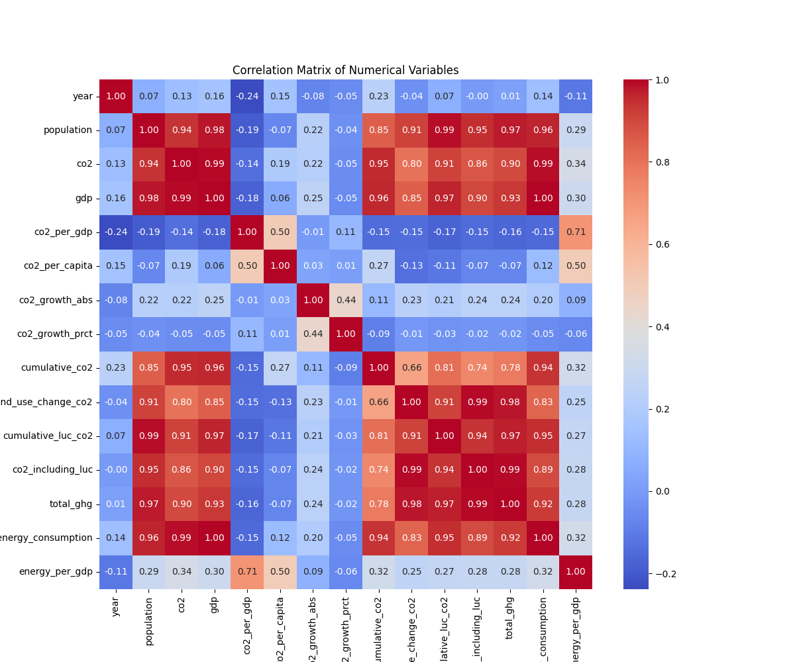

# Collaborative Data Wrangling & EDA

## Project Title

Homework #2: Collaborative Data Wrangling & EDA
DSE 511 – Fall 2026

## Collaborators

- Daniel Saedi Nia

- Mahbuba Jyoti

## Project Structure

```text
south-america-co2-eda/
├── README.md
├── LICENSE
├── requirements.txt
├── data
│   ├── processed      <- The final dataset.
│   └── raw            <- The original.
├── notebooks/
│   └── 01-data_parse.ipynb
│   └── 02-south-america-co2-eda_Viz.ipynb
├── references/
│   └── data_dictionary.md
└── reports/
    └── figures/
```

## Data Source

- Sources:

  - **CO2 and Greenhouse Gas Emissions, Our World in Data (OWID)** (<https://ourworldindata.org/co2-and-greenhouse-gas-emissions>) - underlying data from Global Carbon Budget (2025); Population based on various sources; Bolt and van Zanden – Maddison Project Database 2023. Accessed 09/07/2026. Annual CO2 Emissions and related variables (e,g,. per capita, growth rate, land-use change) for years 1870-2022. Annual CO2 is expressed in million tonnes (Mt). Licesed under Creative Commons BY (CC-BY 4.0). Size: 13.7 MB

  - **Gross Domestic Product, Our World in Data (OWID)** (<https://ourworldindata.org/grapher/gdp-worldbank>) - underlying data from Eurostat, OECD, IMF, and World Bank (2026) with minor processing by OWID. Accessed 09/10/2026. Annual purchasing power parity (PPP) adjusted GDP data from 1990-2025. GDP is expressed in international-$ in 2021 prices. Licesed under Creative Commons BY (CC-BY 4.0). Size: 241 KB

## Methods

### Data Cleaning (Daniel Saedi Nia)

- Sourced CO2 and GDP datasets through reproducible methods in data parse notebook.

- Filtered OWID's raw CO2 dataset down to South American countries and limit scope of analysis

- Reduced cols down to usable and relevant metrics when it comes to comparisons of GDP and CO2 emissions

- Filtered dataset to years 1990 - 2024 due to limitation in dataset from missing data

- Missing GDP values replaced for Guyana and Suriname (missing for all years making filling difficult). Both countries had data from World Bank dataset.

- Replaced GDP entirely for all coiuntries in the South American CO2 dataset for consistency, as World Bank GDP PPP data is expressed in international-$ in 2021 prices, while the original dataset was based in 2011

- Recomputed cols/variables dependent on GDP with necessary unit conversions like `co2_per_gdp` (converting co2 from million tonnes to kilograms)

- Validated the merge and checked for duplicates. Checked values against source pages to ensure correct merge and checked for errors in data.

- Tools/libraries used: Pandas, numpy

### Exploratory Data Analysis (Mahbuba Jyoti)

```text
1. Dataset Overview
2. Data Quality Check
   ├── Missing values
   ├── Duplicate observations
   └── Country/year coverage

3. Univariate Analysis
   ├── CO₂ emissions
   ├── CO₂ per capita
   ├── GDP
   └── Primary energy consumption

4. Country Comparisons
   ├── Total CO₂ by country
   └── CO₂ per capita by country

5. Temporal Analysis
   └── CO₂ trends, 1990–2024

6. Bivariate Analysis
   ├── GDP vs CO₂
   ├── Population vs CO₂
   └── Energy consumption vs CO₂

7. Correlation Analysis

8. Key Findings
```

## Results

## Key Findings from EDA
> **Key Summary:** South American $\text{CO}_2$ emissions are heavily right-skewed and concentrated in large economies like Brazil, showing near-perfect coupling with GDP ($r = 0.993$), primary energy use ($r = 0.990$), and population ($r = 0.939$). However, per-capita emissions follow a completely different pattern—led by smaller nations like Venezuela and Suriname—while a total absence of Venezuelan GDP data from 1990 to 2024 presents a major regional analytical constraint.
> 
### 1. High Regional Concentration
Total emissions are heavily concentrated in a few large economies, primarily **Brazil** (391.59 Mt avg), Argentina, and Venezuela. The resulting distribution is strongly **right-skewed**, meaning a small number of observations account for the vast majority of regional emissions.


***

### 2. Divergence Between Total and Individual Footprints
High total national emissions do not equate to high per-capita emissions. While Brazil leads in absolute terms, **Venezuela** (5.26 t/person) and **Suriname** (4.34 t/person) have significantly higher individual footprints than Brazil (2.08 t/person).


***

### 3. Strong Economic and Energy Coupling
Absolute CO₂ emissions move almost perfectly in lockstep with a country’s economic activity and energy use. However, a country's average individual footprint (**CO₂ per capita**) shows almost no linear relationship to its total economic output (**GDP**).

| Relationship | Correlation ($r$) |
| :--- | :--- |
| GDP & Primary Energy Consumption | 0.997 |
| **GDP & Total CO₂ Emissions** | **0.993** |
| Population & Total CO₂ Emissions | 0.939 |
| **CO₂ per Capita & GDP** | **0.056** |



***

### 4. Important Data Quality Limitation: Venezuela GDP
A critical finding is the complete absence of GDP data (`gdp`), carbon intensity (`co2_per_gdp`), and energy intensity (`energy_per_gdp`) for **Venezuela across the entire study period (1990–2024)**. All analyses linking economic performance to environmental impact for the region are constrained by this missing data.

## Collaboration Notes

- Daniel Saedi Nia contributions: Repo setup, as well as data aquisition and cleaning. GDP source replacement and dataset validation.  

- Mahbuba Jyoti contributions:  Conducted the initial data overview, performed data preprocessing and organization, conducted exploratory data analysis (EDA), and contributed to documentation.

- Both: Collaborated on the project, discussed the analysis and Git workflow, reviewed each other's work, and worked together on the merge conflict resolution.

## Reproducibility Instructions

1. Clone the repository

2. Navigate to project directory

3. If using uv as your package manager, run the following command to install the dependencies:

```bash
uv sync
```

Otherwise, if you are using pip, you can install the dependencies by running:

```bash
pip install .
```

or

```bash
pip install -r requirements.txt
```

4.Run the notebooks located in the notebook folder in the following order.

- `data_parse.ipynb` for data aquisition and cleaning

- `south_america_co2_eda_Viz.ipynb` or `south_america_co2_eda_Viz.py` for EDA

## Merge Conflict Reflection

We first created a branch called `merge-conflict-branch`, then switch back to main and edit a line (line #149) in the README and push our changes. Now that the newly created branch is 1 commit behind we explicitly do not pull or merge from main and edit that same line and also add to our merge conflict reflection.
