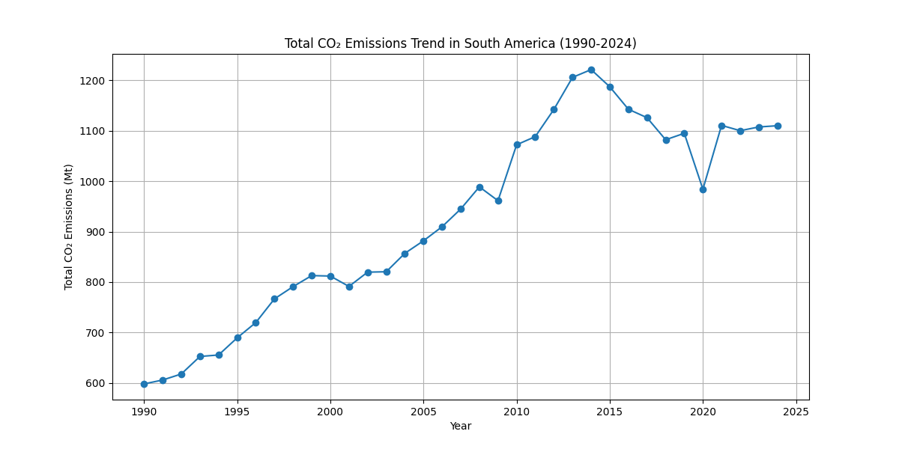
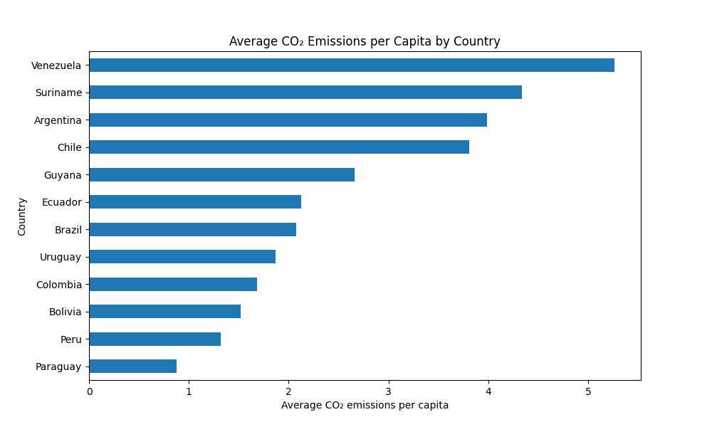
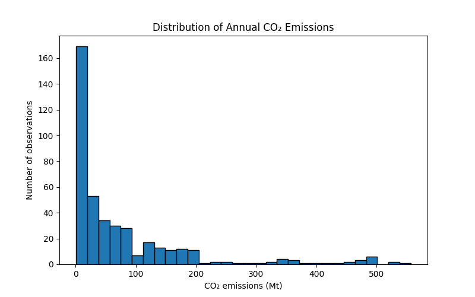
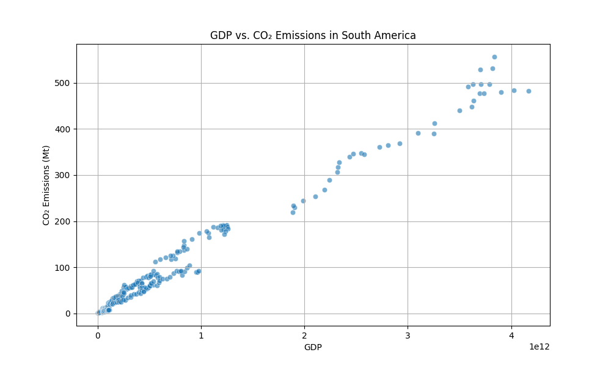
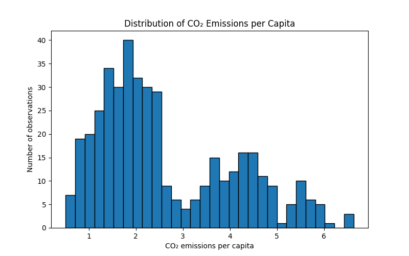
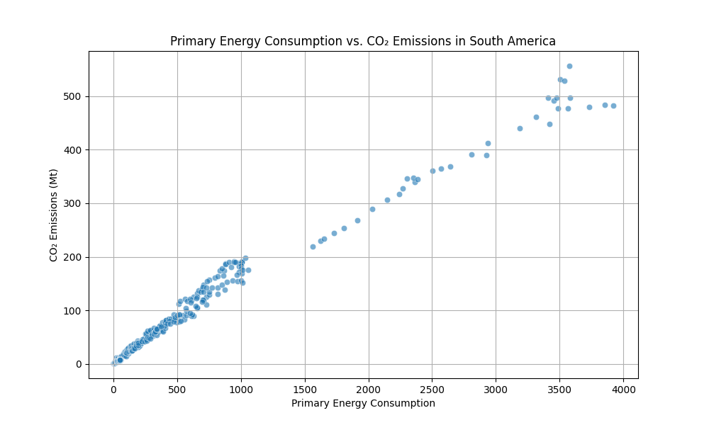

# Collaborative Data Wrangling & EDA

## Project Title

Homework #2: Collaborative Data Wrangling & EDA
DSE 511 – Fall 2026

## Collaborators

- Daniel Saedi Nia

- Mahbuba Jyoti

## Project Structure

```text
south-america-co2-eda/
├── README.md
├── LICENSE
├── requirements.txt
├── data
│   ├── processed      <- The finalg.
│   └── raw            <- The original.
├── notebooks/
│   └── 01-data_parse.ipynb
│   └── 02-south-america-co2-eda_Viz.ipynb
├── references/
│   └── data_dictionary.md
└── reports/
    └── figures/
```
## Data Source

- Source: [Insert dataset name + link (e.g., Our World in Data)]

- Date accessed: [Insert date]

- Description: Briefly describe the dataset (variables, units, scope).

- Size: [e.g., 2.3 MB, 10,000 rows]

- License (if known): [e.g., CC-BY]

## Methods

### Data Cleaning (Daniel Saedi Nia)

- List specific steps (e.g., handled missing values, renamed variables, filtered rows).

- Tools/libraries used (e.g., pandas, numpy).

### Exploratory Data Analysis (Mahbuba Jyoti)
```text
1. Dataset Overview
2. Data Quality Check
   ├── Missing values
   ├── Duplicate observations
   └── Country/year coverage

3. Univariate Analysis
   ├── CO₂ emissions
   ├── CO₂ per capita
   ├── GDP
   └── Primary energy consumption

4. Country Comparisons
   ├── Total CO₂ by country
   └── CO₂ per capita by country

5. Temporal Analysis
   └── CO₂ trends, 1990–2024

6. Bivariate Analysis
   ├── GDP vs CO₂
   ├── Population vs CO₂
   └── Energy consumption vs CO₂

7. Correlation Analysis

8. Key Findings
```
## Results

## Key Findings from EDA
The key findings from the exploratory data analysis (EDA) of South American $\text{CO}_2$ emissions are summarized below:

### 1. Large Differences in Total $\text{CO}_2$ Emissions Across Countries
The analysis shows substantial differences in total $\text{CO}_2$ emissions among South American countries. Brazil has the highest average annual $\text{CO}_2$ emissions, at approximately 391.59 Mt, followed by Argentina (160.16 Mt) and Venezuela (138.22 Mt). In contrast, Guyana and Suriname have considerably lower total emissions. This indicates that total regional $\text{CO}_2$ emissions are concentrated among a relatively small number of countries with larger populations and greater levels of economic and energy activity.



***

### 2. Total $\text{CO}_2$ Emissions and $\text{CO}_2$ per Capita Show Different Patterns
Brazil has the highest total $\text{CO}_2$ emissions, but it does not have the highest average $\text{CO}_2$ emissions per capita. Venezuela and Suriname have the highest average $\text{CO}_2$ emissions per capita, at approximately 5.26 and 4.34 tonnes per person, respectively. This demonstrates that total emissions and per-capita emissions capture different aspects of environmental impact. A country with a smaller population can have relatively low total emissions while still having high emissions per person.



***

### 3. $\text{CO}_2$ Emissions Are Strongly Right-Skewed
The distribution of annual $\text{CO}_2$ emissions is strongly right-skewed. Most country-year observations have relatively low emissions, with many observations below approximately 100 Mt, while a smaller number of observations have substantially higher emissions, including values above 500 Mt. This indicates considerable variation in emissions across countries and years. Because of this skewed distribution, the median can provide a useful representation of a typical observation in addition to the mean.



***

### 4. GDP, Population, Energy Consumption, and $\text{CO}_2$ Are Strongly Associated
The correlation analysis reveals very strong positive relationships among population, economic activity, energy consumption, and total $\text{CO}_2$ emissions. Some of the strongest correlations are:

| Relationship | Correlation (r) |
| :--- | :--- |
| **GDP and $\text{CO}_2$** | 0.993 |
| **GDP and Primary Energy Consumption** | 0.997 |
| **$\text{CO}_2$ and Primary Energy Consumption** | 0.990 |
| **Population and $\text{CO}_2$** | 0.939 |
| **Population and GDP** | 0.976 |

These results indicate that observations with larger populations, higher GDP, and greater primary energy consumption tend to have higher total $\text{CO}_2$ emissions. However, these correlations represent associations and do not establish causal relationships.



***

### 5. Per-Capita Measures Provide a Different Perspective
Although total $\text{CO}_2$ emissions are strongly associated with GDP and population, $\text{CO}_2$ per capita has a much weaker relationship with these variables. The correlation between $\text{CO}_2$ per capita and GDP is only 0.056, while its correlation with population is −0.066. This contrast shows that analyzing only total emissions can hide important differences in emissions intensity at the individual level. Therefore, both total and per-capita measures are important for understanding emissions patterns.



***

### 6. Emissions Intensity Is Related to Energy Intensity
The correlation between $\text{CO}_2$ per GDP and energy per GDP is 0.708, indicating a relatively strong positive association between emissions intensity and energy intensity. This suggests that observations with higher energy use relative to GDP also tend to have higher $\text{CO}_2$ emissions relative to GDP. Measures of emissions and energy intensity therefore provide additional information beyond total emissions.



***

### 7. Missing GDP Data for Venezuela Is an Important Limitation
A significant data-quality limitation is the absence of GDP-related information for Venezuela across the 1990–2024 period. The variables `gdp`, `co2_per_gdp`, and `energy_per_gdp` contain missing values for Venezuela. Consequently, analyses involving these economic indicators may not fully represent all countries in the dataset. This limitation should be considered when interpreting GDP-related comparisons and correlations.


## Collaboration Notes

- Partner A contributions: [e.g., data cleaning, repo setup]

- Partner B contributions: [e.g., EDA, visualization]

- Both: [e.g., documentation, merge conflict resolution]

## Reproducibility Instructions

- How to run the notebook/script (python script.py or open notebooks/EDA.ipynb).

- Dependencies (e.g., requirements.txt or conda environment).

- Special instructions (if any).

## Merge Conflict Reflection (Required)

- Briefly describe the merge conflict you created and how you resolved it.
