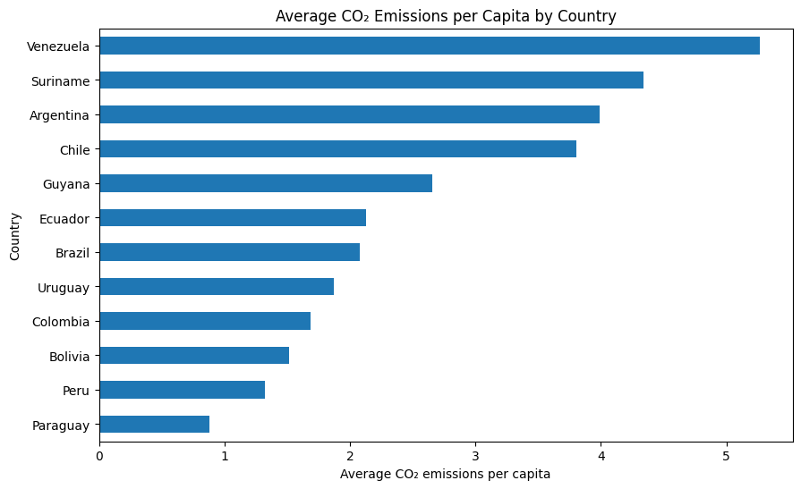

# Collaborative Data Wrangling & EDA

## Project Title

Homework #2: Collaborative Data Wrangling & EDA
DSE 511 – Fall 2026

## Collaborators

- Daniel Saedi Nia

- Mahbuba Jyoti

## Project Structure

```text
south-america-co2-eda/
├── README.md
├── LICENSE
├── requirements.txt
├── data
│   ├── processed      <- The finalg.
│   └── raw            <- The original.
├── notebooks/
│   └── 01-south-america-co2-data_cleaning.ipynb
│   └── 02-south-america-co2-eda_Viz.ipynb
├── references/
│   └── data_dictionary.md
└── reports/
    └── figures/
```
## Data Source

- Source: [Insert dataset name + link (e.g., Our World in Data)]

- Date accessed: [Insert date]

- Description: Briefly describe the dataset (variables, units, scope).

- Size: [e.g., 2.3 MB, 10,000 rows]

- License (if known): [e.g., CC-BY]

## Methods

### Data Cleaning (Daniel Saedi Nia)

- List specific steps (e.g., handled missing values, renamed variables, filtered rows).

- Tools/libraries used (e.g., pandas, numpy).

### Exploratory Data Analysis (Mahbuba Jyoti)
```text
1. Dataset Overview
2. Data Quality Check
   ├── Missing values
   ├── Duplicate observations
   └── Country/year coverage

3. Univariate Analysis
   ├── CO₂ emissions
   ├── CO₂ per capita
   ├── GDP
   └── Primary energy consumption

4. Country Comparisons
   ├── Total CO₂ by country
   └── CO₂ per capita by country

5. Temporal Analysis
   └── CO₂ trends, 1990–2024

6. Bivariate Analysis
   ├── GDP vs CO₂
   ├── Population vs CO₂
   └── Energy consumption vs CO₂

7. Correlation Analysis

8. Key Findings
```
## Results

## Key Findings from EDA

The EDA shows substantial differences in CO₂ emissions across South American countries, with Brazil having the highest average total CO₂ emissions, while Venezuela and Suriname have the highest average CO₂ emissions per capita. Total CO₂ emissions are strongly associated with GDP, population, and primary energy consumption, with correlations of 0.993, 0.939, and 0.990, respectively. The analysis also shows that total emissions and per-capita emissions reveal different patterns across countries.

### Representative Figure

The figure below shows the average CO₂ emissions per capita by country.

how()
```

### Reflection

One interesting finding was that the country with the highest total CO₂ emissions was not the country with the highest CO₂ emissions per capita. This demonstrates why examining both total and per-capita emissions provides a more complete understanding of emissions patterns.


## Collaboration Notes

- Partner A contributions: [e.g., data cleaning, repo setup]

- Partner B contributions: [e.g., EDA, visualization]

- Both: [e.g., documentation, merge conflict resolution]

## Reproducibility Instructions

- How to run the notebook/script (python script.py or open notebooks/EDA.ipynb).

- Dependencies (e.g., requirements.txt or conda environment).

- Special instructions (if any).

## Merge Conflict Reflection (Required)

- Briefly describe the merge conflict you created and how you resolved it.
